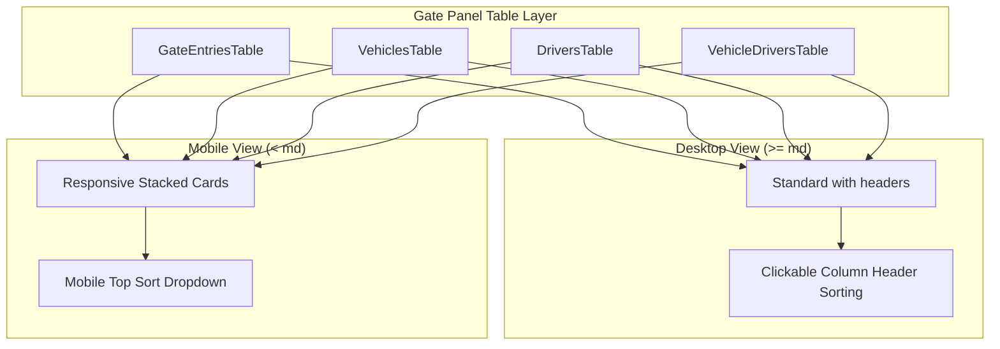

# Requirements

### Overview & Goals
Redesign all `/gate` panel data tables and lists (`GateEntriesTable`, `VehiclesTable`, `DriversTable`, `VehicleDriversTable`) to deliver an optimal dual-mode user experience:
1. **Desktop View (>= md breakpoint)**: Full-featured traditional tabular layout with native column headers, interactive column sorting, clear data alignments, badges, and inline record action buttons.
2. **Mobile View (< md breakpoint)**: Responsive card-based layout using Filament's `stackedOnMobile()` paradigm, rendering each record as a self-contained card with clear key-value hierarchy, touch-friendly action buttons, status badges, and mobile-native sorting controls without horizontal scroll friction.

### Scope
#### In Scope
- **Gate Entries Table (`GateEntriesTable.php`)**:
  - Traditional columns: `vehicle_number` (bold, searchable, sortable), `status` (color badge: warning for 'On Premises', success for 'Exited'), `driver_name` (searchable, sortable), `driver_phone` (phone icon & placeholder), `gated_in_at` (dateTime formatted, sortable), `gated_out_at` (dateTime formatted, placeholder 'On premises', sortable), `created_at` (toggleable).
  - Responsive mobile cards via `stackedOnMobile()`.
  - Filter by `status` (All / On Premises / Exited) and date filters.
  - Quick `Register Exit` record action with confirmation modal delegating to `RegisterGateExit`.
- **Vehicles Table (`VehiclesTable.php`)**:
  - Traditional columns: `number` (Registration No.), `description` (Model / Type), `currentAssignment.driver.name` (Assigned Driver badge), `on_premises` (status badge), `visits_count` (Total Visits count).
  - Responsive mobile cards via `stackedOnMobile()`.
  - Filter by on-premises presence.
- **Drivers Table (`DriversTable.php`)**:
  - Traditional columns: `name` (Driver Name), `id_number` (ID / Passport No.), `phone` (Phone number), `vehicles_count` (Assigned Vehicles count).
  - Responsive mobile cards via `stackedOnMobile()`.
  - Record Edit action and quick search.
- **Vehicle Drivers Table (`VehicleDriversTable.php`)**:
  - Traditional columns: `vehicle.number` (Registration No.), `vehicle.description`, `driver.name` (Driver Name), `driver.phone`, `active` (boolean icon column).
  - Responsive mobile cards via `stackedOnMobile()`.
  - Filter by active status and record actions.
- **UX & Usability Refinement**:
  - Seamless mobile sorting dropdown automatically powered by Filament's stacked table engine.
  - Remove redundant custom sort modals that interfered with standard desktop table header clicks.
  - Ensure touch targets, badge colors, and placeholders are uniform across all views.

#### Out of Scope
- Modifying Admin panel ERP invoice tables (focus is strictly on the `/gate` operational panel datatables).
- Altering core backend database schemas or business domain services.

### Functional Requirements & Acceptance Criteria
- **FR-1 (Desktop Experience)**:
  - On screens >= `md` (768px+), all four gate resources display standard horizontal data tables with distinct column headers (`<th>`).
  - Clicking any sortable column header triggers instant ascending/descending sorting.
  - Column data types are styled appropriately: registration numbers bold, statuses as color-coded badges, timestamps formatted (`d/m/Y H:i`), phone numbers with telephone icons.
  - Action buttons (`Register Exit`, `Edit`) appear in dedicated action columns.
- **FR-2 (Mobile Card Experience)**:
  - On screens < `md` (mobile phones and narrow viewports), rows automatically transform into vertical cards without horizontal table scrolling.
  - Each card displays the primary identifier (e.g. Vehicle Plate or Driver Name) prominently with the status badge.
  - Field labels are cleanly displayed above or alongside their values.
  - Actions (`Register Exit`, `Edit`) render directly within each card as prominent touch buttons.
  - A mobile sort dropdown is accessible at the top of the table.
- **FR-3 (Operational Filters & Quick Actions)**:
  - `GateEntriesTable` includes status filter (`in` vs `out`) so security operators can filter strictly vehicles currently on premises on mobile devices with one tap.

# Technical Design

### Current Implementation Review
1. **Existing Tables Architecture**:
   - `GateEntriesTable`, `VehiclesTable`, `DriversTable`, and `VehicleDriversTable` previously used top-level `Split::make([...])->from('md')` wrappers with custom `SortRecordsAction` modal actions.
   - *Limitation*: Because `Split` wraps all content into Flexbox containers, desktop users did not receive standard table column headers or native table sorting. Furthermore, custom sort modals added extra clicks compared to Filament's native sorting mechanisms.

### Proposed Architecture & Redesign
1. **Table Configuration Standard (`stackedOnMobile`)**:
   - Re-architect each table to define discrete, strongly-typed `TextColumn` and `IconColumn` instances directly on `$table->columns([...])`.
   - Chain `->stackedOnMobile()` on `$table`.
   - Filament will render standard HTML `<table>` elements with clickable `<th>` headers on desktop, and automatically swap to responsive stacked card containers with card styling, proper spacing, and mobile sort dropdowns on mobile viewports.
2. **Column Definitions & Visual Polish**:
   - **GateEntries**:
     ```php
     $table->columns([
         TextColumn::make('vehicle_number')->label('Vehicle No.')->weight(FontWeight::Bold)->searchable()->sortable(),
         TextColumn::make('status')->label('Status')->badge()
             ->formatStateUsing(fn (string $state): string => $state === GateLog::STATUS_IN ? 'On Premises' : 'Exited')
             ->color(fn (string $state): string => $state === GateLog::STATUS_IN ? 'warning' : 'success'),
         TextColumn::make('driver_name')->label('Driver')->searchable()->sortable(),
         TextColumn::make('driver_phone')->label('Phone')->icon('heroicon-m-phone')->placeholder('—'),
         TextColumn::make('gated_in_at')->label('Gate In')->dateTime('d/m/Y H:i')->sortable(),
         TextColumn::make('gated_out_at')->label('Gate Out')->dateTime('d/m/Y H:i')->placeholder('On premises')->sortable(),
     ])->stackedOnMobile()
     ```
   - **Vehicles**:
     ```php
     $table->columns([
         TextColumn::make('number')->label('Registration No.')->weight(FontWeight::Bold)->searchable()->sortable(),
         TextColumn::make('description')->label('Description')->searchable()->sortable()->placeholder('—'),
         TextColumn::make('currentAssignment.driver.name')->label('Assigned Driver')->badge()->color('info')->placeholder('Unassigned'),
         TextColumn::make('status')->label('Location')
             ->state(fn (Vehicle $record): string => $record->gateLogs()->where('status', 'in')->exists() ? 'On Premises' : 'Outside')
             ->badge()
             ->color(fn (string $state): string => $state === 'On Premises' ? 'warning' : 'gray'),
         TextColumn::make('visits_count')->counts('gateLogs')->label('Total Visits')->alignEnd()->sortable(),
     ])->stackedOnMobile()
     ```
   - **Drivers**:
     ```php
     $table->columns([
         TextColumn::make('name')->label('Driver Name')->weight(FontWeight::Bold)->searchable()->sortable(),
         TextColumn::make('id_number')->label('ID / Passport No.')->searchable()->placeholder('—'),
         TextColumn::make('phone')->label('Phone')->icon('heroicon-m-phone')->searchable()->placeholder('—'),
         TextColumn::make('vehicles_count')->counts('vehicles')->label('Assigned Vehicles')->alignEnd(),
     ])->stackedOnMobile()
     ```
   - **VehicleDrivers**:
     ```php
     $table->columns([
         TextColumn::make('vehicle.number')->label('Registration No.')->weight(FontWeight::Bold)->searchable()->sortable(),
         TextColumn::make('vehicle.description')->label('Vehicle Description')->placeholder('—'),
         TextColumn::make('driver.name')->label('Driver Name')->searchable()->sortable(),
         TextColumn::make('driver.phone')->label('Driver Phone')->placeholder('—'),
         IconColumn::make('active')->label('Active Assignment')->boolean(),
     ])->stackedOnMobile()
     ```
3. **Filtering & Quick Operational Actions**:
   - Add `SelectFilter::make('status')` to `GateEntriesTable` allowing security guards to toggle between 'All', 'On Premises (`in`)', and 'Exited (`out`)'.
   - Retain `Register Exit` row action with `requiresConfirmation()` and `RegisterGateExit` domain delegation.

### Architecture Diagram


### Proposed Changes & File Structure
- `app/Filament/Gate/Resources/GateEntries/Tables/GateEntriesTable.php` *(Update)*: Reconfigure columns to standard definitions with `->stackedOnMobile()`, add status filters, refine exit action.
- `app/Filament/Gate/Resources/Vehicles/Tables/VehiclesTable.php` *(Update)*: Reconfigure columns to standard definitions with `->stackedOnMobile()`, location badge, visit counts.
- `app/Filament/Gate/Resources/Drivers/Tables/DriversTable.php` *(Update)*: Reconfigure columns to standard definitions with `->stackedOnMobile()`, phone icons, vehicle count badges.
- `app/Filament/Gate/Resources/VehicleDrivers/Tables/VehicleDriversTable.php` *(Update)*: Reconfigure columns to standard definitions with `->stackedOnMobile()`, boolean icons, search attributes.
- `tests/Feature/GateResponsiveTableTest.php` *(New)*: Automated tests asserting table column configuration, sorting, filtering, and record actions.

# Testing

### Validation Approach
Verify that all four gate resource tables render all required columns, support column sorting, filter correctly by operational criteria, and execute record actions seamlessly.

### Key Scenarios & Test Matrix
1. **Gate Entries Table**:
   - Verifies `vehicle_number`, `status`, `driver_name`, `driver_phone`, `gated_in_at`, and `gated_out_at` columns exist and are searchable/sortable.
   - Status filter properly segments records by `in` vs `out`.
   - `registerExit` action executes exit workflow and updates record status to `out`.
2. **Vehicles Table**:
   - Asserts registration number, description, driver badge, and visit counters render accurately.
   - Sorting by registration number and visit count operates correctly.
3. **Drivers Table**:
   - Asserts driver name, ID number, phone, and vehicles count columns are present.
   - Search by driver name and phone works as expected.
4. **Vehicle Drivers Assignment Table**:
   - Asserts vehicle registration, driver name, and active boolean icon are displayed.
5. **Regression & Quality Verification**:
   - Run `php artisan test` to verify all existing tests (Invoice, Gate In, Gate Out, Login Audit, M-Pesa API) and new responsive tests remain 100% green.
   - Run `vendor/bin/pint --test` to confirm PSR-12 and Pint styling compliance.

# Delivery Steps

### ✓ Step 1: Redesign Gate Entries Table for Dual Desktop/Mobile Layout & Operational Filtering
GateEntriesTable renders full desktop columns with native sorting and transitions to responsive stacked cards on mobile devices.

- Update `app/Filament/Gate/Resources/GateEntries/Tables/GateEntriesTable.php` to define discrete standard table columns (`vehicle_number`, `status`, `driver_name`, `driver_phone`, `gated_in_at`, `gated_out_at`, `created_at`).
- Chain `->stackedOnMobile()` to automatically render structured cards with badges and field labels on mobile viewports (< `md`).
- Add `SelectFilter::make('status')` enabling 1-tap filtering between 'All', 'On Premises (`in`)', and 'Exited (`out`)'.
- Ensure `registerExit` action with confirmation modal renders seamlessly in desktop action columns and within mobile cards.
- Remove redundant custom modal sort action to leverage native desktop header sorting and Filament's mobile sort dropdown.

### ✓ Step 2: Redesign Vehicles, Drivers, and Vehicle-Driver Assignment Tables
Vehicles, Drivers, and VehicleDrivers tables render clean desktop tabular columns and convert to mobile cards without horizontal scrolling.

- Update `app/Filament/Gate/Resources/Vehicles/Tables/VehiclesTable.php` with standard columns for Registration No., Description, Assigned Driver badge, On Premises location badge, and Total Visits count, chained with `->stackedOnMobile()`.
- Update `app/Filament/Gate/Resources/Drivers/Tables/DriversTable.php` with standard columns for Driver Name, ID / Passport No., Phone (with phone icon), and Vehicles count, chained with `->stackedOnMobile()`.
- Update `app/Filament/Gate/Resources/VehicleDrivers/Tables/VehicleDriversTable.php` with standard columns for Vehicle Plate, Vehicle Description, Driver Name, Driver Phone, and Active assignment boolean icon, chained with `->stackedOnMobile()`.
- Ensure standard create/edit record actions and toolbar buttons integrate cleanly on both desktop and mobile viewports.

### ✓ Step 3: Implement Automated Responsive Tests & Code Quality Verification
Comprehensive test suite asserting column schemas, sorting, filtering, and record actions across all Gate tables.

- Create `tests/Feature/GateResponsiveTableTest.php` testing `ListGateEntries`, `ListVehicles`, `ListDrivers`, and `ListVehicleDrivers` Livewire table components.
- Assert all columns, search attributes, status filters, and exit actions render and execute without errors.
- Run `php artisan test` to verify 100% test pass rate across the full application suite.
- Run `vendor/bin/pint --test` to guarantee PSR-12 and Pint styling compliance.