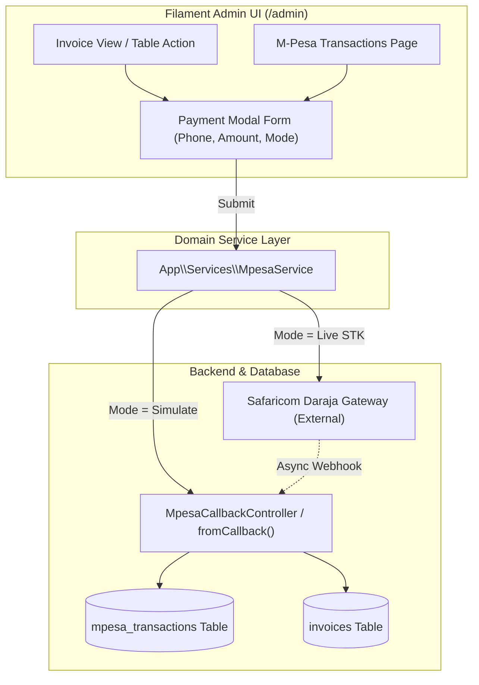

# Requirements

### Overview & Goals
Provide an interactive UI within the Filament Admin panel to test and present the M-Pesa integration. Users can enter a customer phone number and amount, select between direct simulation or live Daraja STK Push, trigger payments via a "Pay" action button, and review transaction results and history in real time.

### Scope
#### In Scope
- **Invoice Payment Modal**: Modal action on AR Invoices (list table and detail view) pre-filling invoice total and reference with phone number entry and payment trigger.
- **Dual Execution Engine**: Support for both instant local callback simulation (for offline testing/demoing) and live Daraja STK Push API dispatch.
- **M-Pesa Transaction Resource**: Filament admin resource for viewing, searching, filtering, and inspecting all incoming and simulated M-Pesa transactions and raw payloads.
- **Standalone Payment Sandbox**: Action on the M-Pesa transactions list to test payments with arbitrary phone numbers, amounts, and bill references without needing an invoice.
- **Invoice Payment History**: Displaying linked M-Pesa transactions on the Invoice detail view (`InvoiceInfolist`).

#### Out of Scope
- Automated refund or B2C disbursement workflows.
- Customer-facing public checkout portal (payments are initiated/tested from the admin panel).

### User Stories
- As an **Administrator or Demo Presenter**, I want to open an invoice or payment sandbox, enter a phone number and amount, and click "Pay" so that I can demonstrate and verify M-Pesa payment workflows immediately.
- As an **Accountant / ERP User**, I want to view all received M-Pesa payments alongside their linked invoices and customer details to reconcile accounts accurately.
- As a **Developer / QA Engineer**, I want to simulate M-Pesa callbacks locally without requiring active Safaricom Daraja network connectivity.

### Functional Requirements
- **Kenyan MSISDN Validation**: Phone numbers must validate and normalize to standard Kenyan MSISDN formats (`2547XXXXXXXX`, `2541XXXXXXXX`, `07XXXXXXXX`, or `01XXXXXXXX`).
- **Amount Validation**: Amount must be positive numeric with up to 3 decimal places matching the system currency precision standard.
- **Simulation Mode**: Generates a realistic Daraja C2B/STK transaction payload, persists it via `MpesaTransaction::fromCallback()`, and associates it with the referenced invoice.
- **Live STK Push Mode**: Uses Daraja API credentials configured in `config/mpesa.php` to issue an STK Push prompt to the target mobile device.
- **Instant Feedback**: Filament notifications display payment status, transaction reference (`TransID`), and error details if rejected or timed out.

### Non-Functional Requirements
- **Idempotency & Concurrency**: Leverages existing unique `transaction_id` constraints and idempotent handling in `MpesaTransaction`.
- **Security**: Sensitive Daraja API secrets remain secured in environment variables; webhook validation secrets are maintained.

# Technical Design

### Current Implementation
- `app/Http/Controllers/Api/MpesaCallbackController.php`: Handles C2B `validation` and `confirmation` webhooks with optional `X-Callback-Secret` check.
- `app/Models/MpesaTransaction.php`: Maps STK Push and C2B payloads into structured columns with raw payload persistence.
- `config/mpesa.php`: Contains Daraja credentials (`consumer_key`, `consumer_secret`, `shortcode`, `environment`, `callback_secret`).
- `app/Filament/Resources/Invoices/`: Filament resource managing AR Invoices (`InvoicesTable`, `InvoiceInfolist`, `ViewInvoice`).

### Key Decisions
- **Service Layer Abstraction (`App\Services\MpesaService`)**: Encapsulates both live Daraja API communication (OAuth token, STK push) and local simulation dispatch. This avoids duplicating payload formatting logic across controllers and UI actions.
- **Dual-Mode UI Action**: In the payment modal, users can toggle between "Simulation" (instant local response) and "Live STK Push" (real API call), enabling seamless demos even without internet access or valid sandbox credentials.
- **Filament Action on Invoices**: Implementing the primary trigger as a Filament Action modal on `InvoiceResource` directly connects invoicing data with payment testing.
- **Dedicated Transaction Resource**: Exposing `MpesaTransactionResource` in the Admin panel under `Sales – AR` allows inspecting transaction history and triggering standalone test payments.

### Architecture Diagram

### Proposed Changes
1. **`app/Services/MpesaService.php`**:
   - `simulatePayment(string $phone, float $amount, string $billRef, ?string $transId = null): MpesaTransaction`
   - `sendStkPush(string $phone, float $amount, string $reference, string $description): array`
   - `generateDarajaToken(): ?string`
   - `normalizePhoneNumber(string $phone): string`
2. **`app/Filament/Resources/Invoices/Pages/ViewInvoice.php` & `InvoicesTable.php`**:
   - Add `Action::make('payMpesa')` with modal form fields: `phone_number`, `amount`, `mode` (`simulate` / `stk_push`), `bill_ref_number`.
3. **`app/Filament/Resources/Invoices/Schemas/InvoiceInfolist.php`**:
   - Add an M-Pesa Payments section displaying transaction history for the current invoice.
4. **`app/Filament/Resources/MpesaTransactions/`**:
   - New Filament Resource with table columns, date filters, search by phone/trans ID, JSON payload viewer, and a "Test Payment" header action.

### File Structure
- `app/Services/MpesaService.php` *(new)*
- `app/Filament/Resources/MpesaTransactions/MpesaTransactionResource.php` *(new)*
- `app/Filament/Resources/MpesaTransactions/Pages/ListMpesaTransactions.php` *(new)*
- `app/Filament/Resources/MpesaTransactions/Pages/ViewMpesaTransaction.php` *(new)*
- `app/Filament/Resources/MpesaTransactions/Tables/MpesaTransactionsTable.php` *(new)*
- `app/Filament/Resources/MpesaTransactions/Schemas/MpesaTransactionInfolist.php` *(new)*
- `app/Filament/Resources/Invoices/Pages/ViewInvoice.php` *(modified)*
- `app/Filament/Resources/Invoices/Tables/InvoicesTable.php` *(modified)*
- `app/Filament/Resources/Invoices/Schemas/InvoiceInfolist.php` *(modified)*
- `tests/Unit/MpesaServiceTest.php` *(new)*
- `tests/Feature/MpesaInvoicePaymentTest.php` *(new)*

### Risks & Mitigations
- **Network timeouts during live STK push**: Set strict HTTP client timeout (`10s`) and handle connection exceptions gracefully with user-friendly notification messages.
- **Phone number formatting inconsistencies**: Automatic regex normalization converting `07...` or `01...` to `254...` format before dispatch.

# Testing

### Validation Approach
Automated feature and unit tests will verify phone number normalization, simulation payload persistence, STK push API mock integration, and Filament modal actions.

### Key Scenarios
- **Payment Modal Submission (Simulation Mode)**: Opening the payment modal on an invoice with amount 5,000, entering phone number `0712345678`, selecting Simulation, and submitting. Verifies that `mpesa_transactions` table contains a new record with `254712345678`, `5000.00`, and the matching `bill_ref_number`.
- **Payment Modal Submission (Live STK Mode)**: Mocking Daraja OAuth and STK push HTTP endpoints with `Http::fake()`, submitting the modal, and verifying outgoing API payload parameters.
- **Phone Number Normalization**: Testing variations `0712345678`, `+254712345678`, `254712345678`, and `0112345678` correctly normalize to `254XXXXXXXXX`.
- **Transaction Resource Listing & Inspection**: Accessing `/admin/mpesa-transactions`, filtering by transaction ID, and viewing the formatted raw payload.
- **Invoice Infolist Transaction Display**: Viewing an invoice that has received payments and verifying the M-Pesa transaction details are rendered.

### Test Changes
- `tests/Unit/MpesaServiceTest.php`: Tests for phone normalization, simulation payload generation, and mock STK push requests.
- `tests/Feature/MpesaInvoicePaymentTest.php`: Tests for Filament invoice payment modal action and notification dispatch.
- `tests/Feature/MpesaTransactionResourceTest.php`: Tests for M-Pesa transaction list, view, and standalone test payment action.

# Delivery Steps

### ✓ Step 1: Create M-Pesa Service & Execution Engine
A robust service encapsulating Daraja STK Push requests, local callback simulation, and invoice reconciliation logic is available in the application.

- Create `app/Services/MpesaService.php` to handle authentication token generation, Lipa Na M-Pesa STK Push API requests, and local transaction simulation.
- Implement `simulatePayment(string $phone, float $amount, string $billRef, ?string $transId = null)` to dispatch structured C2B/STK payloads directly into the callback handling pipeline.
- Implement `sendStkPush(string $phone, float $amount, string $reference)` to interface with Safaricom Daraja sandbox/production endpoints.
- Add payment reconciliation helper to link received payments with target `Invoice` records by `bill_ref_number`.
- Add unit tests in `tests/Unit/MpesaServiceTest.php` covering payload generation, simulation, and token generation handling.

### ✓ Step 2: Add M-Pesa Payment Action Modal to Invoices
Admin users can initiate and test M-Pesa payments directly from the AR Invoices table and individual invoice view pages.

- Add a `Pay with M-Pesa` modal action to `app/Filament/Resources/Invoices/Pages/ViewInvoice.php` and `app/Filament/Resources/Invoices/Tables/InvoicesTable.php`.
- Build the modal form schema with phone number input (with Kenyan format validation `2547...`), amount field (pre-filled with invoice total), reference field, and execution mode toggle (`Simulation` vs `Live STK Push`).
- Connect form submission to `MpesaService` and dispatch Filament notifications with transaction details upon completion.
- Add an infolist section to `app/Filament/Resources/Invoices/Schemas/InvoiceInfolist.php` displaying payment transactions associated with the invoice.
- Add feature tests in `tests/Feature/MpesaInvoicePaymentTest.php` verifying modal action submission and invoice payment status updates.

### ✓ Step 3: Implement M-Pesa Transaction Resource & Test Interface
Administrators have a dedicated interface to inspect all transactions, review raw webhook payloads, and trigger test payments independently.

- Create `app/Filament/Resources/MpesaTransactions/MpesaTransactionResource.php` and related table/infolist pages under the `Sales – AR` navigation group.
- Implement columns for `transaction_id`, `trans_amount`, `msisdn`, `bill_ref_number`, `first_name`, and `trans_time` with sorting and filtering.
- Add a header action `Test Payment` on the transactions list allowing quick ad-hoc testing with custom numbers and amounts.
- Add raw payload JSON viewer in the transaction detail infolist for troubleshooting Daraja webhook payloads.
- Add feature tests in `tests/Feature/MpesaTransactionResourceTest.php` to verify resource access and test payment action execution.